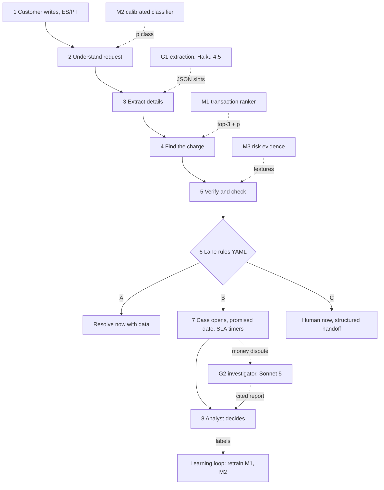
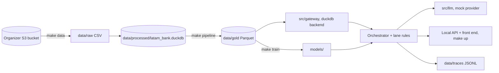
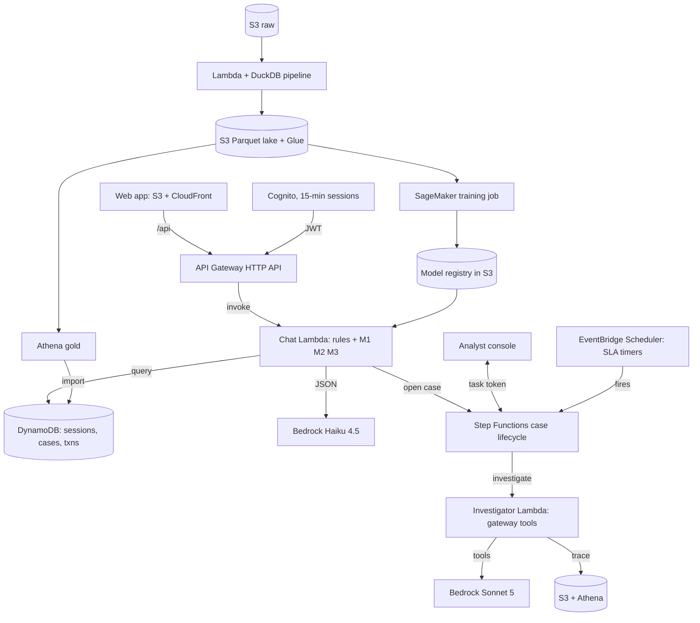

# Architecture

Current target architecture from plan v2 (sections 4, 8 and 9 of `docs/plan/expediente-vivo-v2.html`). Kept as Mermaid so it stays reviewable as text; update it when an interface in `INTERFACES.md` changes.

## Customer flow

## Local development (everyone)

## Cloud (operated by andres only)

